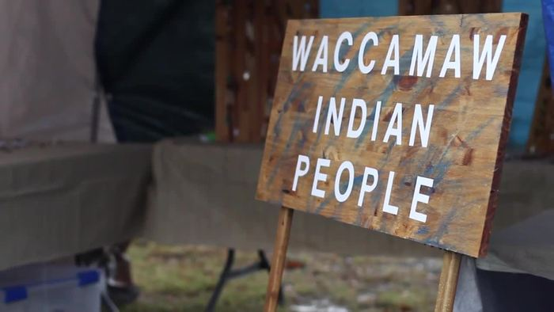

# December 2022 Open Meeting Summary

-

Michelle Hatcher
- Jan 7, 2023
- 5 min read

Tribal Open Meeting Summary 12/02/2022  held at the tribal office and via Zoom

1.

CMs Marion, Robert, Chris, Glenn, Susan, Marie, and CoC Dalton were present. Elders Larry J and Becky S were present. Chief Hatcher, VC Cheryl, and 2C Alan were present.

2.

Members Emily W, Nancy J, and Starla C were present. David H present. Members Carol H, David B, and Anita H were present via Zoom.

3.

Resolution: DH-12-02-2022-001: Certification of the 2022 Tribal Election

  1.

Marie voted to accept with change to Cheryl’s name and adding an “f” to Chief; Robert seconded

    1.

Susan: concerns; this was the lowest voter turnout we’ve had

      1.

2C Alan: part of the problem was USPS and some people never got a ballot

      2.

Marion: we all need to write our Congressmen about the USPS

      3.

Susan: I think we need to go to email and extend voting to allow people to vote at the pauwau

        1.

Marie: and post it on Facebook so people know

        2.

Chris: ask in the email if they will be voting in-person

        3.

Glenn: let people vote absentee

    2.

Marie-yes, Robert-yes, Chris-yes, Glenn-yes, Marion-yes, Susan-yes, Dalton-yes

    3.

CoC Dalton swore in Marion C, Chris H, Susan H, Chief Hatcher, and VC Cheryl

4.

Financial Report (as of 11/30/2022 at 11:40 pm)

  1.

General Fund: $28,446.44

  2.

Building Fund: $2883.15

  3.

Cemetery Fund: $407.00

5.

Old Business

  1.

Online Votes

    1.

10/12: Approve use of the office for class on moccasins and ribbon shirts with Aki

      1.

Marie-yes, Robert-yes, Chris-yes, Glenn-yes, Marion-yes, Susan-yes, Dalton-yes

    2.

11/28: Approve October 2022 Meeting Summary

      1.

Marie-yes, Robert-yes, Chris-yes, Glenn-yes, Marion-yes, Susan-yes, Dalton-yes

6.

New Business

  1.

Receipts

    1.

For RV & electric: $616.15 to Glenn C

      1.

Marie-yes, Robert-yes, Chris-yes, Glenn-yes, Marion-yes, Susan-yes, Dalton-yes

      2.

Check 1067

    2.

For PW: $1992.26 to Glenn C

      1.

Marie-yes, Robert-yes, Chris-yes, Glenn-yes, Marion-yes, Susan-yes, Dalton-yes

      2.

Check 503

  2.

Committee Reports

    1.

Building & Grounds: Glenn C

      1.

Send in volunteer time

      2.

Clayton J donated 7 bags of mulch

      3.

RV work where Chief’s site sits is done

        1.

Need my box back eventually

      4.

Need to hook up water to Chief’s RV spot and dump station

      5.

Phil W wants 4 more receptacles

      6.

Dirt leveled down in the front

      7.

Chief Hatcher: you can get a tax credit for volunteer hours

        1.

If you want receipts for your time, tell the Chief the number of hours and dollar amount

    2.

Grants: Michelle

      1.

SCAC final report needs to be done when the link appears in the portal

    3.

Pauwau: CoC Dalton

      1.

The budget is attached; some receipts still coming in

      2.

Volunteer appreciation dinner & Outbrief on 12/4 at El Cerro

      3.

Glenn C: a few inquiries on dance payouts: people not in regalia

        1.

Someone jumped over hay bales to get in the circle and then had no regalia on

        2.

Chris H: people don’t keep regalia on during the rain

        3.

CoC Dalton: John A told people to take regalia off and at times to come in the arena without it

        4.

Chris H: think if they disregard the circle, they shouldn’t win

        5.

Glenn C: think a letter is appropriate; not let her dance next year if unacceptable

        6.

Susan: we can look at pictures

      4.

Glenn C: we cannot have 2 campers hooked to 1 RV spot

        1.

Chris H: one light on that circuit wouldn’t blow it

        2.

Marie: you could have told us and we could use our generator

        3.

Michelle: Anyone who wants a RV site needs to let us know they are coming to be sure they have a spot

        4.

Chris H: She can use my spot next year

        5.

CoC Dalton: we will discuss it further and come up with a policy letter

        6.

VC Cheryl: practicality with empathy

      5.

Anita H: I didn’t like all the people in cowboy hats and jeans in the ring

        1.

Susan: it was during intertribal

    4.

Drum

      1.

Drummed for School Days

      2.

Chief Hatcher: how do we handle boys and girls who want to drum on school day?

        1.

Glenn C: it depends on whether you want to stay traditional

        2.

Chief Hatcher: call the other drums and come up with a policy

      3.

2C Alan: in Cheraw, Keepers of the word were there with regular drum

      4.

Susan: we got a call from a female drum in GA; brought it to the PW committee who thought it was too close to PW

        1.

The GA drum then thought it was too far to drive

      5.

Chief Hatcher: traditions change

      6.

Susan: we could use female drums on Family Day or fire ceremonies

    5.

Files

      1.

Marie: Motion to make Emily W and Lauren M full members; Marion second

        1.

Marie-yes, Robert-yes, Chris-yes, Glenn-yes, Marion-yes, Susan-yes, Dalton-yes

    6.

Newsletter

      1.

Looking for someone to step in and take over

        1.

Susan: Lindsey S said she would

        2.

CoC Dalton: I’ll reach out to her and see if she wants to do it by herself or with others

      2.

CoC Dalton: if the drama over the newsletter wants to go to the next step, it should go to the tribal judge

        1.

VC Cheryl: there should be a step before that

        2.

CoC Dalton: like to the Elders

        3.

VC Cheryl: I took a day reconfiguring one company’s policy for the tribe

        4.

I suggest CM’s buddy up with new members and mentor them

        5.

Going straight to the tribal judge is deflecting

        6.

Chief Hatcher: keep in mind they have to break a policy for it to be taken to the tribal judge

  3.

Fire ceremony: 12/17/2022 at sunrise

  4.

Glenn C: Turkey Shoot

    1.

Need to make sure it’s okay with the firearms resolution

    2.

Would we be interested in doing this?

      1.

Marie-yes, Robert-yes, Chris-yes, Glenn-yes, Marion-yes, Susan-yes, Dalton-yes

      2.

CoC Dalton: it’s something you want on paper and read 3 times

    3.

Marie: Are you looking for donations for prizes or is the tribe paying for it?

      1.

Glenn C: the tribe would have to pay for it

    4.

VC Freddie from Santee would help us

    5.

VC Cheryl: make sure it stays within the guidelines

    6.

Glenn C: Horry County says no permit if we don’t have vendors

      1.

Santee was making $2000/ night

        1.

Susan: they were making it mostly off food

        2.

Elder Larry J: do not during pauwau because of the horse

      2.

Susan: I propose we let him pursue this; Marie seconded

        1.

Marie-yes, Robert-yes, Chris-yes, Glenn-yes, Marion-yes, Susan-yes, Dalton-yes

    7.

Glenn C: city police had no objections

      1.

We have noise ordinances to follow

      2.

Would like to start October 1

    8.

VC Cheryl: Amend the firearms resolution

    9.

Glenn C: one house gun that everybody shoots with; we supply the shells

    10.

David H: make sure the insurance policy covers it

    11.

CoC Dalton: in PW: archery and axe-throwing

    12.

Susan: go to Bass Pro Shops for prizes/ donations

  5.

VC Cheryl

    1.

Environmental Justice (EJ) Grant & Grant Writing Development

      1.

We are in an EJ zone

        1.

Climate: help mitigate change with flooding

        2.

Community garden: food source

        3.

Move from High-emission use- electric charging stations

        4.

Reforestation (carbon credits)

        5.

Community activities

      2.

LA launched a pilot program with NOAA for $70k in 2022 to get started

    2.

Education Task Force

      1.

Need more volunteers working on cultural programs

      2.

Their next meeting is in January.

  6.

2C Alan

    1.

Start thinking about food for Family Day

      1.

VC Cheryl: low country boil

      2.

CoC Dalton: or BBQ

      3.

VC Cheryl: or both

  7.

Chief Hatcher

    1.

The Council of Chiefs met with SoS to stop him from chartering new tribes without going through the recognition process

      1.

Laws would have to change

    2.

2C Alan has worked with the state museum and it has no tribes represented

    3.

Meeting with SCIDC to help fund Native students going to college; on 12/12

      1.

I think we will extend it to trade classes as well

    4.

My youngest son’s mother killed herself; think we should send him something

    5.

Chief Worthy asked us to do the funeral for PAIA Chief

    6.

This PW went really well

    7.

Pursue the drum deeply

    8.

Introduced James Gore

    9.

Did 2 interviews in the last week

    10.

When Biden said what he did about helping Indians

      1.

It only helps federally recognized Indians

      2.

Write letters to him and let him know that all Indians need help

        1.

I’ll send out a sample letter

        2.

To Biden, Harris, BIA

        3.

VC Cheryl: and Deb Haaland

        4.

Send Chief Hatcher an email and let him know you will write a letter

  8.

Elder Larry J

    1.

Commend the person who did the program book; it’s the best one yet

    2.

Proposal: Let’s do a parade before the PW on Saturday

      1.

VC Cheryl: right before the gates open

  9.

David B

    1.

Honorary member and came to the pauwau; it was the most fantastic thing I’ve ever seen

      1.

CCU students- impressive find

      2.

Most spiritual thing was when Marion saged me

      3.

I want to do more; be more active

  10.

Chris H: need to think about making Carson & Malia Junior HM/ HL

Susan motioned to close the meeting; Marie seconded.

	Susan-yes, Robert-yes, Marion-yes, Glenn-yes, Marie-yes, Chris-yes, CoC Dalton-yes

Meeting adjourned at 9:20 pm.

Respectfully submitted by Michelle Hatcher on 1/6/2023 at 12:19 pm.

