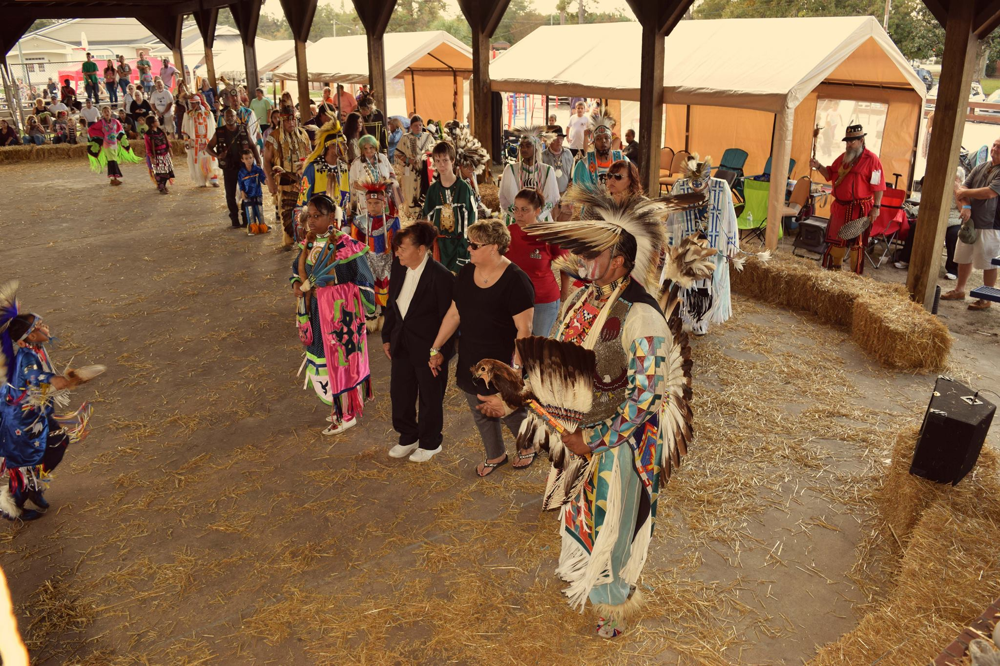

# 24th Annual Pauwau & Cultural Arts Festival

-

Doug Hatcher
- Aug 10, 2016
- 1 min read

Our 24th Annual Cultural Arts Festival & Pauwau will be held Saturday, November 5th and Sunday, November 6th, 2016 at the tribal grounds, 591 Bluewater Rd, Aynor, SC.  We invite you to join us for the event.  The gates will open at 11:00 AM on both days.  There will be two Grand Entries on Saturday, held at 1:00 PM and 6:00 PM.  On Sunday there will be one Grand Entry held at 2:00 PM.

Our arena participants are:

Host Drum
 *Edisto River Singers*

Master of Ceremonies
 *John Blackfeather*

Arena Director
 *Doug Logan*

Lead Female Dance
 *Aki Day Hedgepeth*

Lead Male Dancer
 *Frederick Hawkins*

Adults $7.00, Seniors 60 and over $4.00, Children 6 and under free and 7-14 $4.00

HOST MOTEL

Econo Lodge

1101 Church St.

Conway, SC  29526

843 248-2285

Mention the Pauwau for the discounted rate of $53.00 + tax

For more information, please contact the Pauwau Committee by email: Jennifer Hatcher: [[email protected]](/cdn-cgi/l/email-protection)

Susan Hayes-Hatcher: [[email protected]](/cdn-cgi/l/email-protection)

Or by phone: (843) 358-6877.

[#community](https://www.waccamaw.org/updates/hashtags/community) [#volunteer](https://www.waccamaw.org/updates/hashtags/volunteer) [#Pauwau](https://www.waccamaw.org/updates/hashtags/Pauwau)

