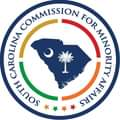

# America's Field Trip Contest for Students

-

Michelle Hatcher
- Mar 5, 2024
- 2 min read

From Joshua Shumak and the SC Commission for Minority Affairs

Good Morning,

I have been asked to share this opportunity for students with you all by America250’s Tribal Partnership Director.

America250’s next programming effort, America’s Field Trip – America’s Field Trip is a new contest that invites students across the country in grades 3–12 to be part of America’s 250th anniversary by sharing their perspectives on what America means to them — and earning the opportunity to participate in unforgettable field trip experiences at some of the nation’s most iconic historic and cultural landmarks.

Students may submit artwork, videos, or essays in response to the contest’s prompt: “What does America mean to you?”

Twenty-five first-place awardees from each grade level category will receive free travel and lodging for a 3-day, 2-night trip to a select historical or cultural site where they will experience one of the following:

Tour of the Statue of Liberty in New York

Tour and hike at Yellowstone National Park in Wyoming and Montana

Weekend at Rocky Mountain National Park in Colorado

Unique tours at the National Archives or the Library of Congress in Washington, DC

Special tours at the Smithsonian’s National Museum of American History, National Museum of African American History and Culture, or the National Museum of Natural History in Washington, DC

Explore America’s iconic financial capital, New York City, with private tours of Federal Reserve Bank of New York Museum and Learning Center and The Bank of New York Mellon, the country’s oldest bank

Experience National Parks of Boston with a special visit to the USS Constitution and a sunset cruise to Spectacle Island

Candlelight tour at Fort Point at the base of the Golden Gate Bridge

Costumed roleplaying experience at American Village in Alabama

Second-place awardees will receive a $500 cash award.

Submissions may be received here: [https://america250.org/fieldtrip/](https://america250.org/fieldtrip/)

If you have questions about America’s Field Trip or the materials, please reach out to [[email protected]](/cdn-cgi/l/email-protection#cdaea2a0a0b8a3a4aeacb9a4a2a3be8daca0a8bfa4aeacfff8fde3a2bfaa).

Tags:

- [Native](https://www.waccamaw.org/updates/tags/native)
- [Announcement](https://www.waccamaw.org/updates/tags/announcement)
- [#Education](https://www.waccamaw.org/updates/tags/education-1)

