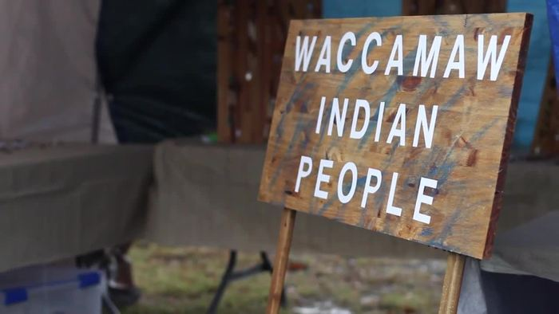

# June 2023 Open Meeting Summary

-

Michelle Hatcher
- Jun 28, 2023
- 5 min read

Tribal Open Meeting Summary 6/2/2023  held at the tribal office and via Zoom

1.

CMs Marion, Glenn, Susan, and CoC Dalton were present. Elder Becky and Glenn T were present. VC Cheryl and 2Cs Alan F and John T were present. Chief Hatcher was present.

2.

Members Nancy J, Starla C, David B, Randy W, Carol H, Emily W, Rebecca F, Aaron F, Coby F, Josh W, Jennifer R, Lisa L, and Jeanie W were present.

3.

CM Marion requested a moment of silence for Marie

4.

Elder Becky nominated Nancy J to be a CM

  1.

VC Cheryl: when is that seat up?

    1.

CM Susan- next year

    2.

CoC Dalton swore Nancy J in as CM.

5.

Financial Report  (as of 6/1/2023 at 12:28 am)

  1.

General Fund: $29,199.87

  2.

Building Fund: $3203.42

  3.

Cemetery Fund: $407.00

6.

Old Business

  1.

Online Votes

    1.

5/23 Approve May Open Meeting Summary

      1.

Change tractor to junk motor

      2.

Glenn-yes, 2C Alan (for Susan)-yes, Marion-yes, CoC Dalton-yes, Susan-abstain

    2.

5/24 Allow Linda Atkinson to use the tribal grounds for her birthday

      1.

Susan-yes, Glenn-yes, Marion-yes, CoC Dalton-yes

    3.

5/31 Does the Tribal Council approve the grant application as written?

      1.

Susan-yes, Glenn-yes, Marion-yes, CoC Dalton-yes

    4.

5/31 Does the tribal Council approve the wording for the proposed plaque to be placed on the tribal grounds?

      1.

Susan-yes, Glenn-yes, Marion-yes, CoC Dalton-yes

7.

New Business

  1.

Fuel Receipts: $35.35

    1.

Susan-yes, Glenn-yes, Nancy J-yes, Marion-yes, CoC Dalton-yes

    2.

Check

  2.

Committee Reports

    1.

Buildings & Grounds: Glenn

      1.

Donnie had some asphalt removed or moved around

        1.

Man giving it to us hasn’t lived up to his word of 8 loads of crushed asphalt

      2.

The tractor is messed up

        1.

2C John: should we look at spending money on the tractor

        2.

Glenn & Marion: there’s a noise, it could be hydraulic fluid

        3.

Glenn: its only other problem is power steering

      3.

I worked at the cemetery and bush hogging done, plan to move the fence

        1.

Marion: trees were cut there

      4.

Someone came out and wanted to work for pay; I explained we didn’t do that

      5.

PW gate: do we need approval or can we start working on it?

        1.

2C Alan: how long would it be?

        2.

Glenn: 60-80 feet

        3.

Susan: we need to do something; people ignored us telling them to wait until the kids were gone

        4.

Susan motioned for Glenn to proceed and get prices; Glenn seconded

        5.

Steve W: I am a fabricator and might be able to help

        6.

Susan-yes, Glenn-yes, Marion-yes, Nancy-yes CoC Dalton-yes

    2.

Arts & Crafts: Susan

      1.

I would like to have more classes done out here

      2.

I’m starting a 1-day class with OLLI- a choker and a presentation about the tribe

      3.

I’ll possibly do a 6-week course in the Fall

    3.

Grants

      1.

CCU NEH grant: VC Cheryl

        1.

We’re doing further research on our community at the Dimery Settlement

        2.

It could require us to take a trip to the UK

        3.

Funding would be used for research and to develop more cultural enhancements

        4.

It’s a $25k grant with no cost-share or match

        5.

Tribal members helping with the grant would receive a stipend

      2.

Black River Interest Working Group: Marion

        1.

They want tribes to work together to create a park

        2.

No motor boats or landings

        3.

We could have Family Day there

        4.

The next meeting is in July

        5.

VC Cheryl: at one point, the Waccamaw tribe was on the Black River on the south side

        6.

We’d like more people to help with plant identification and foraging

        7.

It focuses on tribes that were in that area

    4.

Pauwau: Michelle & CoC Dalton

      1.

Krispy Kreme fundraiser

        1.

Buy during June using the link and we will receive 50% of the funds

      2.

Popcorn Fundraiser: still looking at; says no money upfront, but I’m unsure about after

      3.

Working on budget

      4.

Need a story on the history & traditions of the drum for the program book

      5.

Looking for pictures of our older members

      6.

Susan: the drum still hasn’t signed the contract; I mailed it on 4/13

      7.

Next pauwau meeting: 6/8 at 6:30 pm via Zoom

      8.

Susan: Nancy Basket said to hold off on her contract; she’s taking care of her mother

        1.

Aki said to hold off on her contract; she wants to stay at a BNB in Conway

        2.

Put TBD on the flyer until we know for sure if they’re coming

    5.

Newsletter

      1.

The newsletter was forwarded to Council and VC Cheryl

      2.

Susan: it won’t look the same once it’s printed

        1.

VC Cheryl: I may be able to take it from JPEG to PDF

        2.

Susan: we could print it off as-is and put it in an envelope

        3.

VC Cheryl: I may be able to take it to a place to turn it into how we want it printed

        4.

Susan: currently, it would be 3 pages printed

        5.

Marion: does it have to be front and back? A lot of people only look at the information on one side

        6.

I can make copies

        7.

CoC Dalton: Chell and I can stamp, fold, and label

        8.

Susan motioned to let Marion print off the newsletter and mail it

        9.

Marion: I need labels and stamps

        10.

CoC Dalton: I can authorize up to $150

        11.

Susan amended her motion: Allow Marion to print off the newsletter and get the supplies he needs to mail by the end of the week; Glenn seconded

        12.

Susan-yes, Glenn-yes, Marion-yes, Nancy-yes CoC Dalton-yes

    6.

Drum

      1.

There was a meeting last month to try to get us back in the groove

        1.

We all live so far apart

    7.

Files

      1.

Paula Cribb: renew her honorary membership for 5 years

  3.

CoC Dalton

    1.

I need a list of the current cemetery trustees and want someone here to represent them every month

      1.

Chief Hatcher: the cemetery belongs to the tribe; we set some people as trustees

        1.

There’s no process or procedure for who can/ cannot be buried in the cemetery

        2.

Trustees feel like they have total control of the cemetery

      2.

Glenn C: Richard T ran a few things by me, but I can’t get people to go with him on it

        1.

Example: wanting to charge upkeep every month

        2.

The trustees said the court made them trustees

        3.

CoC Dalton: that’s not true; the tribe did that

      3.

Chief Hatcher: I’ll be meeting with them and know there will be pushback

        1.

They have no written processes

        2.

VC Cheryl: I suggest convening a meeting between the trustees and Tribal Council

        3.

Chief Hatcher: the only trustee named in the court case was Hilda

        4.

Susan read an email from 2016 from 2C John

        5.

Chief Hatcher: I want people to be buried where they were promised to be buried

        6.

CoC Dalton: I want to be at that meeting; it’s ultimately a committee with 1 mandatory member

  4.

2C Alan

    1.

Dr. Andrews- eye exams in Bishopville on the second Monday of the month

      1.

He’ll do 6 per day

      2.

Free eye exams and glasses at his cost

      3.

Address: 730 W Church St, Bishopville, SC 29010

    2.

Marion nominated the 3 professors for membership and I’d like to add David H to that list

  5.

VC Cheryl

    1.

Leadership Development for Tribal Government

      1.

I spoke to Dr. Brant about working with CCU

        1.

Frame up tribal leadership development

        2.

New CM’s could take a course in it

    2.

I met with the Waccamaw Community Foundation and they are interested in starting an endowment for us

      1.

The money would grow

      2.

I would like for him to attend a business meeting with Tribal Council

        1.

CoC Dalton: set up the date

    3.

I sat down with Senator Hembree and let him know what we’re pursuing/ our goals

      1.

He said when we got ready to do the building structure, we’ll need a community development grant

        1.

He assured me we would have it

  6.

Chief Hatcher

    1.

2C Alan, respond to the Indian Development Council; they may reimburse you

      1.

2C Alan: I’m not worried about that

    2.

I’d like Nancy J to attend the meeting between 2C John and Elder Becky

  7.

David B: I’m glad donuts came up today

  8.

VC Cheryl: Rebecca F, will you be taking over the SC Indigenous Education Task Force?

  9.

2C John: I nominate Jennifer R for full membership

  10.

CoC Dalton: the O’rourks donated the cornhole game

  11.

Marion: Summer solstice is 6/17 at 6:05 am, noon, and evening

Susan motioned to close the meeting; Glenn seconded.

	Susan-yes, Glenn-yes, Marion-yes, Nancy-yes CoC Dalton-yes

The meeting adjourned at 9:15 pm.

Respectfully submitted by Michelle Hatcher on 6/28/2023 at 5:05 pm.

Tags:

- [meeting](https://www.waccamaw.org/updates/tags/meeting)
- [Native](https://www.waccamaw.org/updates/tags/native)
- [minutes](https://www.waccamaw.org/updates/tags/minutes)
- [solstice](https://www.waccamaw.org/updates/tags/solstice)
- [waccamaw](https://www.waccamaw.org/updates/tags/waccamaw)
- [Fundraiser](https://www.waccamaw.org/updates/tags/fundraiser)

