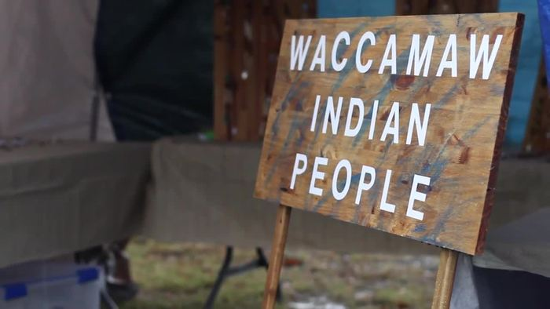

# March 2023 Open Meeting Summary

-

Michelle Hatcher
- Mar 17, 2023
- 4 min read

Updated: Mar 17, 2023

Tribal Open Meeting Summary 3/3/2023  held at the tribal office and via Zoom

1.

CM’s Susan, Chris, Marion, Marie, Robert, Glenn, and CoC Dalton were present. VC Cheryl and 2C John were present. Elders Larry J, Becky, Glenn T, and Charles H were present.

2.

Financial Report (as of 3/2/2023 at 12:15 am)

  1.

General Fund: $30,890.19

  2.

Building Fund: $3267.00

  3.

Cemetery Fund: $407.00

3.

Old Business

  1.

Online Votes

    1.

2/4 Purchase filler for the ditch

      1.

CM Glenn C: no prices yet

    2.

2/4 Purchase new chairs for Council and Chiefs

      1.

No discussion yet

    3.

2/24 Approve February Meeting Summary with changes

      1.

5(a)(vi)(2)(c)(iv)(2) should be Chief, not Chie

      2.

5(a)(iv)(3) should just be drum, not HM too

      3.

Robert-yes, Susan-yes, Chris-yes, Marie-yes, Marion-yes, Glenn-yes, Dalton-yes

4.

New Business

  1.

Presentation from Elizabeth Ruth Wilson, Director of OLLI

    1.

OLLI: Osher Lifelong Learning Institute

      1.

[https://www.coastal.edu/olli/](https://www.coastal.edu/olli/)

      2.

Targets age 50+

      3.

Want to make sure their members know of our culture in the area

      4.

There are courses in the Summer

        1.

Susan: is there a cost to be a member?

        2.

Elizabeth: $40/year and $5/hr/course

        3.

Is that an affordable price?

        4.

CoC Dalton: I think $40/year is affordable

        5.

Elizabeth: some programs are free

        6.

Susan: was there for the Taste of OLLI

        7.

There are various classes, including movie making

        8.

When we met, I mentioned that management would be a good course for the tribe

        9.

Elizabeth: We had 50+ courses over the Spring

      5.

VC Cheryl: I reconnected with Dr. Bryant on the tribal leadership course, but it is in the Raleigh-Durham area- could it brought here?

        1.

Elizabeth: we can explore it; there are 125 OLLIs throughout the country

      6.

CoC Dalton: how will OLLI be affected by HR999 in FL?

  2.

Committee Reports

    1.

Buildings & Grounds: Glenn

      1.

Larry J and others fixed the step by the front door

      2.

We will finish hooking up the dump station tomorrow; David H installed it

      3.

No prices on fill dirt; I’ll call again tomorrow at 8:30

      4.

Susan donated a TV; we will hook it up tomorrow

      5.

Chris: check with Martin Sarvis for dirt

      6.

Glenn: we cleared up the back room of the old trailer

      7.

Marie: David has more logs to drop off for the longhouse

    2.

Arts & Crafts: Susan

      1.

I would like to come up with a program

      2.

7/11 program with OLLI 9-11:45- a choker and Waccamaw presentation

        1.

Do 1 in the summer and 6 weeks in the Fall

    3.

Grants: Michelle

      1.

SCAC grant money received ($5200)

        1.

We probably won’t receive one this year because we received it twice in a row

        2.

Could do drum or School Day

      2.

VC Cheryl: Sustainability grant filed with CCU near $10k

        1.

Plenty of support and they know we’re developing into bigger projects

        2.

Expecting a proposal from Earth Design

        3.

[http://earthdesignsc.com/](http://earthdesignsc.com/)

        4.

We need to do an Impact Study in case we decide to change anything

        5.

Phase I: longhouse, small garden, additional funds for rain garden

        6.

Office of Resilience, SC Parks, and SC DNR

        7.

Develop community, habitat, and restoration

        8.

The proposal shows what we’re doing and how we want to get it done

        9.

Clemson is interested in helping

        10.

Roughly $3000 from Community Engagement Grant

        11.

Can use towards the Spring Equinox

        12.

CoC Dalton: I’d like to get us back into Fishing Day

        13.

VC Cheryl: I sent a flyer for Equinox to help with engagement

        14.

EPA has EJ grants for disadvantaged areas are federal grants, but we can’t be the applicant because of the way they define a tribe

        15.

We have to collaborate with organizations and subgrant them

        16.

We have to start with a consultant

    4.

Pauwau: Michelle

      1.

Working on budget

      2.

Need a story on the history & traditions of the drum for the program book

      3.

Discussing getting a few children-sized T-shirts to see how they sell

      4.

Discussing sending people on the Gate Pass List wristbands ahead of time to indicate they have paid

    5.

Files: Marie

      1.

We got a lot of work done on the last workday

      2.

Thank you to Susan for the template for honorary certificates

      3.

We need to order an ink roller

        1.

Glenn: was around $65

        2.

CoC authorized up to $150 for the ink roller

      4.

We need to order another fireproof file cabinet, but they are expensive

        1.

Marion: get prices for the next meeting

      5.

Files meeting tomorrow at 1 pm

      6.

ID printer works well since it was cleaned

    6.

Newsletter: Susan

      1.

Lindsey will do the newsletter

      2.

I have sent a copy of the older newsletter

      3.

I will work with her if she needs help

  3.

VC Cheryl

    1.

We’re working toward the development of an outdoor living museum

    2.

Dr. Dillian will lead the steering committee

      1.

Look at all the parts we want to get done; bring them to Council as necessary

    3.

I’m trying to decide on meeting monthly or having quarterly groups working monthly

    4.

3/18 will be the kickoff of the project

    5.

I’m on the board of the Waccamaw Community Foundation, so I would have to abstain from votes concerning the project

  4.

Marion: a used grill costs $2400; a new one is $3000

    1.

Elder Glenn T: I have one you can use anytime you want it; save the money

  5.

Marie: we need oyster shells to put in the post holes on the longhouse

    1.

VC Cheryl: try Oyster Landing in Murrells Inlet

  6.

David H: Using cedar trees on the longhouse

  7.

2C John: thank you to Richard T for letting us use his grill; I would offer him a tank of gas

    1.

Glenn motioned; Marion seconde to buy a tank of propane for Richard T’s frill

      1.

Robert-yes, Susan-yes, Chris-yes, Marie-yes, Marion-yes, Glenn-yes, Dalton-yes

  8.

Susan: Chief Hatcher got a call from Phil Comfort’s sister-in-law; Phil passed away on 12/31/2022

  9.

2C John: there was talk about activities at the Spring Equinox; we didn’t talk about food

    1.

CoC Dalton: no food for the Equinox

  10.

Susan: when we went to an oyster roast, we discussed doing another fundraiser

    1.

Hog Heaven for the pauwau

    2.

VC Cheryl: we might get a better facility for better food

  11.

Marie: on Fishing Day, are you giving away items?

    1.

CoC Dalton: yes

    2.

VC Cheryl: we can do a raffle, but there is state paperwork involved

      1.

COC Dalton: we can do it as a giveaway

    3.

Susan: Rick H has the information from past events

    4.

Marion: September Equinox is 9/23/23

    5.

CoC Dalton: continue the discussion via email

    6.

Susan: we could do it in August

  12.

Glenn C: HTC: we can get a free extension wifi and hardwire it further out on the grounds

    1.

Free installation available

    2.

HTC has Plume and EECO (?)

  13.

David B: I’m here to teach

    1.

What did our people use to make lures and hooks?

      1.

I would like to teach these during Fishing Day

    2.

I ran a large fishing tournament for college student

      1.

The fastest way to make money is through auctions

        1.

Example: bait buckets for $20

Susan motioned to close the meeting; Marie seconded.

	Robert-yes, Susan-yes, Chris-yes, Marie-yes, Marion-yes, Glenn-yes, Dalton-yes

The meeting adjourned at 8:24 pm.

Respectfully submitted by Michelle Hatcher on 3/17/2023 at 1:46 pm.

Tags:

- [meeting](https://www.waccamaw.org/updates/tags/meeting)
- [Native](https://www.waccamaw.org/updates/tags/native)
- [minutes](https://www.waccamaw.org/updates/tags/minutes)
- [equinox](https://www.waccamaw.org/updates/tags/equinox)

