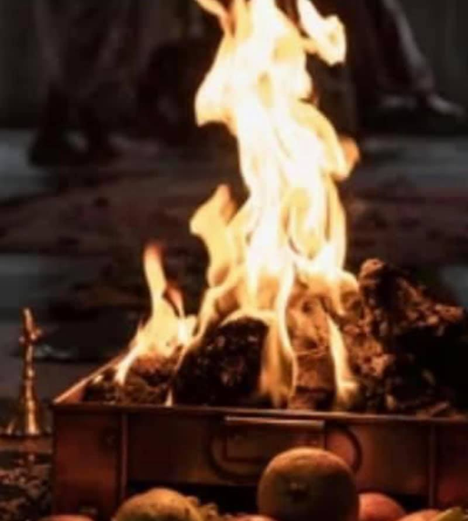

# Summer Solstice 6/18/2022

-

Michelle Hatcher
- Jun 8, 2022
- 1 min read

Summer Equinox: Fire ceremony will be Saturday, June 18 at 6:05am, 12:00 noon, and 7:00 pm.  Will you be joining us?

[#savethedate](https://www.waccamaw.org/updates/hashtags/savethedate)

Tags:

- [Announcement](https://www.waccamaw.org/updates/tags/announcement)
- [solstice](https://www.waccamaw.org/updates/tags/solstice)

