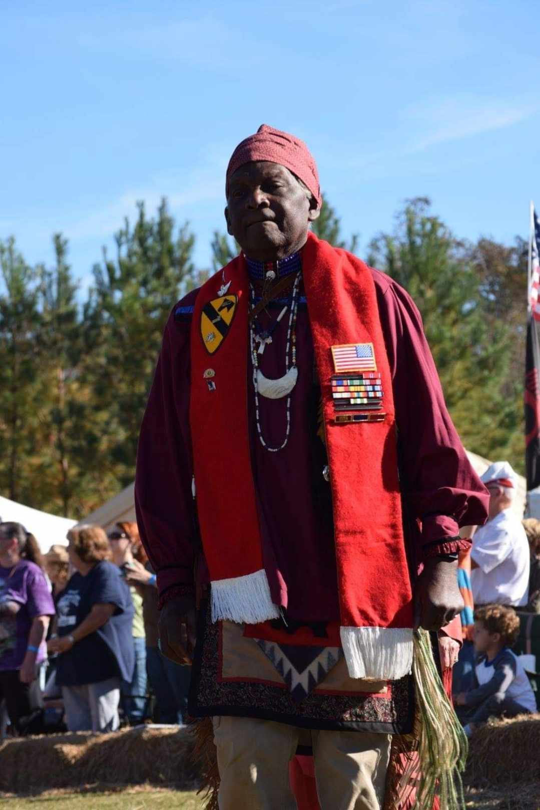

# Tap E Ya Bernard Hamilton

-

Michelle Hatcher
- Jan 3, 2024
- 1 min read

Sad News

Tanakahey:

I am informed that Bernie Hamilton, died last night in a hospital emergency room.

I don't know the details and the arrangements have not

 yet been finalized. I'll share them when I have them.

I'm sorry for our collective loss.

Buster

Tags:

- [Native](https://www.waccamaw.org/updates/tags/native)
- [Waccamaw](https://www.waccamaw.org/updates/tags/waccamaw-2)
- [RIP](https://www.waccamaw.org/updates/tags/rip)

