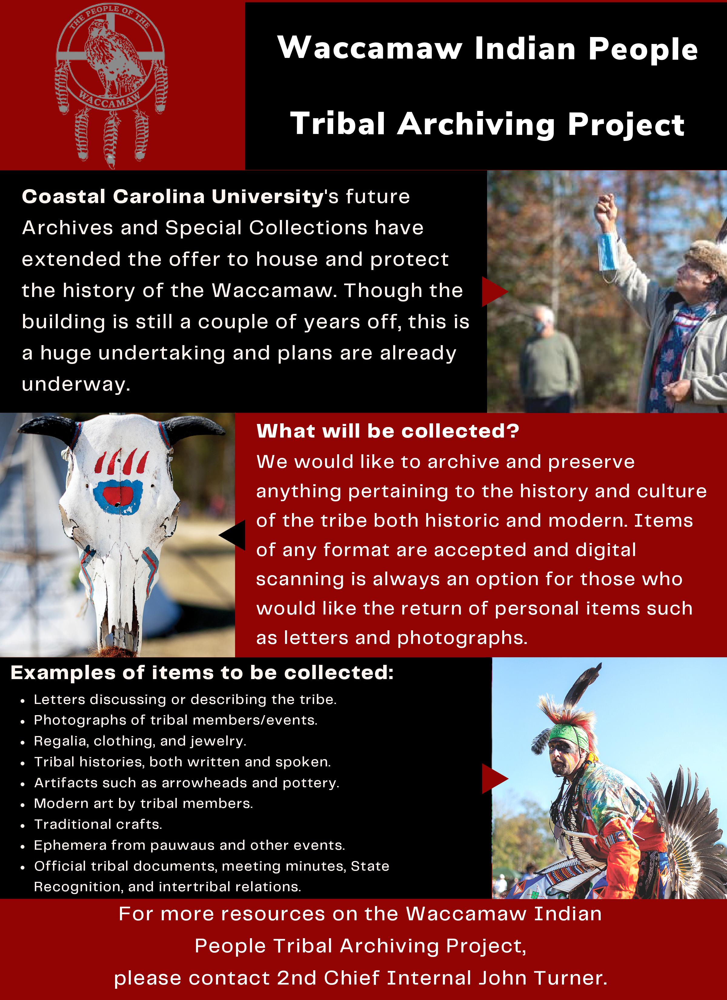

# Waccamaw Indian People Archiving Project

-

Michelle Hatcher
- Apr 9, 2022
- 1 min read

Updated: May 10, 2022

If you are a member and interested in assisting with the project, please contact 2C John Turner at: [[email protected]](/cdn-cgi/l/email-protection)

Tags:

- [Announcement](https://www.waccamaw.org/updates/tags/announcement)
- [native](https://www.waccamaw.org/updates/tags/native-1)
- [waccamaw](https://www.waccamaw.org/updates/tags/waccamaw)

