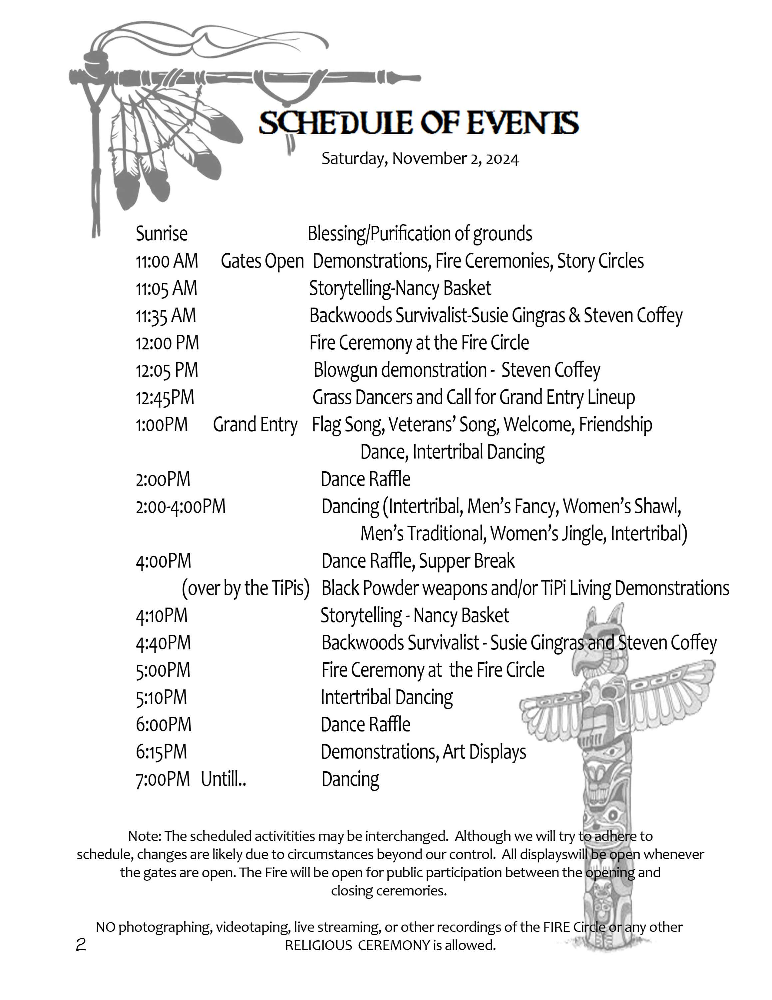
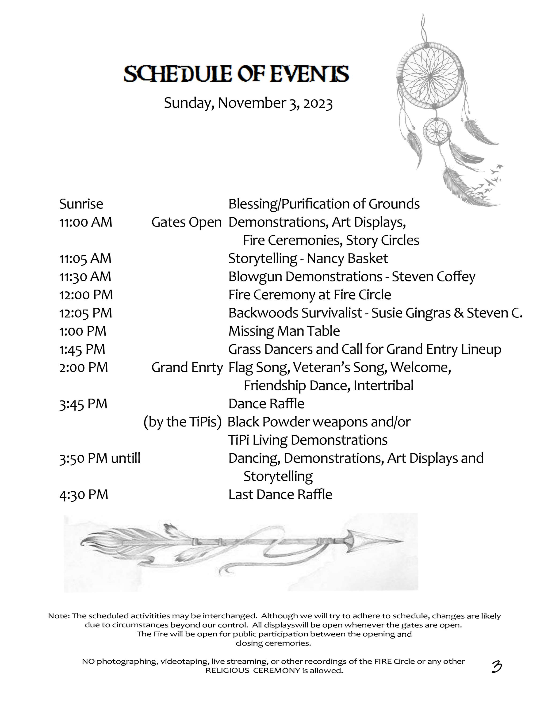
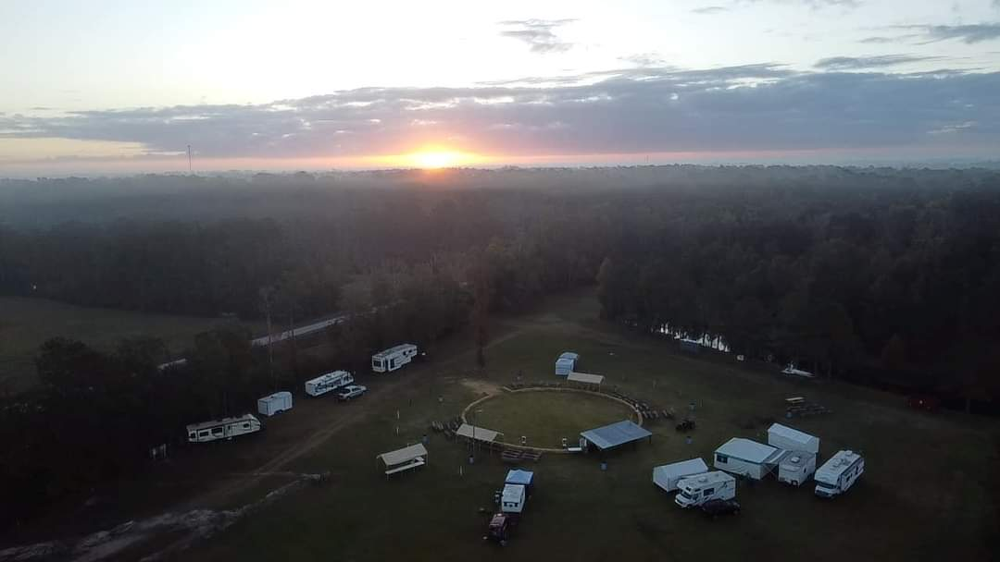
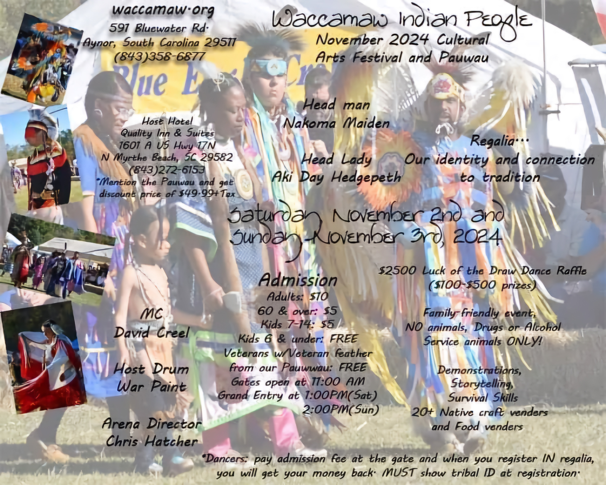

# Waccamaw Pauwau 2024

-

Michelle Hatcher
- Oct 31, 2024
- 1 min read

Gates open at 11am on Saturday and Sunday.  Grand Entry is at 1 pm on Saturday and 2 pm on Sunday. Don't forget to set your clock back an hour on Saturday night.

Tags:

- [Native](https://www.waccamaw.org/updates/tags/native)
- [#Waccamaw](https://www.waccamaw.org/updates/tags/waccamaw-1)
- [event](https://www.waccamaw.org/updates/tags/event)

