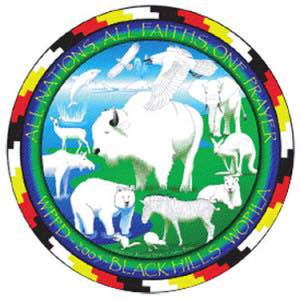

# World Peace & Prayer Day

-

Doug Hatcher
- Jun 7, 2017
- 2 min read

World Peace and Prayer Day, South Carolina will coincide with the main gathering on Hawai'i Island on Mauna Kea, where the South Carolina Indian Affairs Commission will have a delegate.

For more information please see our event page

https://www.facebook.com/events/726461124192794??ti=ia

or

worldpeaceandprayer.com

Waccamaw Traditional Fire Ceremony for World Peace and Prayer, South Carolina

Date: June 25, 2017

Time: The Fire will be available from Sunrise   until evening

*Ceremony begins at Noon

Location:

Waccamaw Tribal Grounds

591 Bluewater Rd

Aynor, SC 28511

We request that everyone please wear regalia or dress modestly. Children must be supervised at all times.

Please leave pets at home.

Following the birth of a White Buffalo Calf in 1994, the Keeper of the White Buffalo Calf Pipe for the Lakota, Dakota and Nakota Nations— Chief Arvol Looking Horse, was directed to honor the Four Directions with ceremony on Summer Solstice/June 21st. According to Lakota Star Knowledge, the birth of “Miracle,” a female white buffalo, signaled a time of Earth changes and the coming of The Mending of the Hoop of all Nations. The Summer Solstice is said to be a powerful time to pray for peace and harmony among all Living Beings. Grandmother Earth’s gifts; the air, water, plant, animal, and rock nations must be allowed to heal if we are to live in harmony with Her.

Ancient prophecies throughout the world have predicted this time…when population growth, over consumption, depletion of our natural resources and pollution would severely damage our Earth’s life-sustaining capabilities. It has become Chief Looking Horse’s personal commitment as the “Keeper of the Sacred Bundle” to assist in the fulfillment of the Mending of the Hoop of all Nations. Besides his work with his own community, meeting with global and spiritual leaders around the world and speaking and offering prayers at Universities and environmental symposiums, (including the United Nations); Chief Looking Horse’s mission with World Peace and Prayer Day has already made tremendous contributions to the progress of Earth Awareness and World Peace.

[#solstice](https://www.waccamaw.org/updates/hashtags/solstice) [#festival](https://www.waccamaw.org/updates/hashtags/festival) [#ceremony](https://www.waccamaw.org/updates/hashtags/ceremony)

