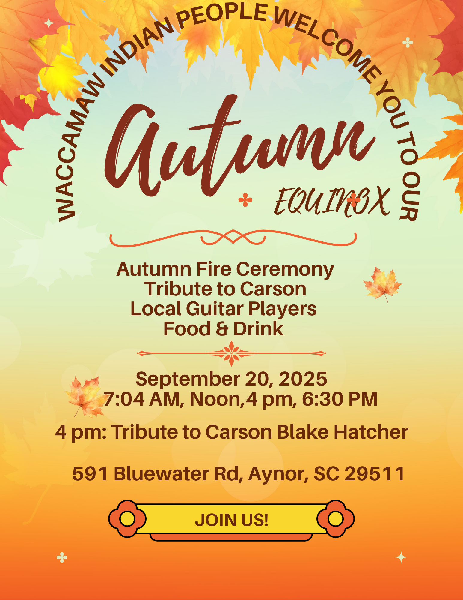

# Autumn Equinox 2025

-

Michelle Hatcher
- Aug 17
- 1 min read

Updated: 6 days ago

The autumn equinox is almost here! We invite you to join our celebration on September 20th with events scheduled for 7:04 a.m., Noon, 4:00 p.m., and 6:30 p.m. Let's welcome the new season together.

Tags:

- [Native](https://www.waccamaw.org/updates/tags/native)
- [Waccamaw](https://www.waccamaw.org/updates/tags/waccamaw-2)
- [#SaveTheDate](https://www.waccamaw.org/updates/tags/savethedate)
- [AutumnEquinox](https://www.waccamaw.org/updates/tags/autumnequinox)

