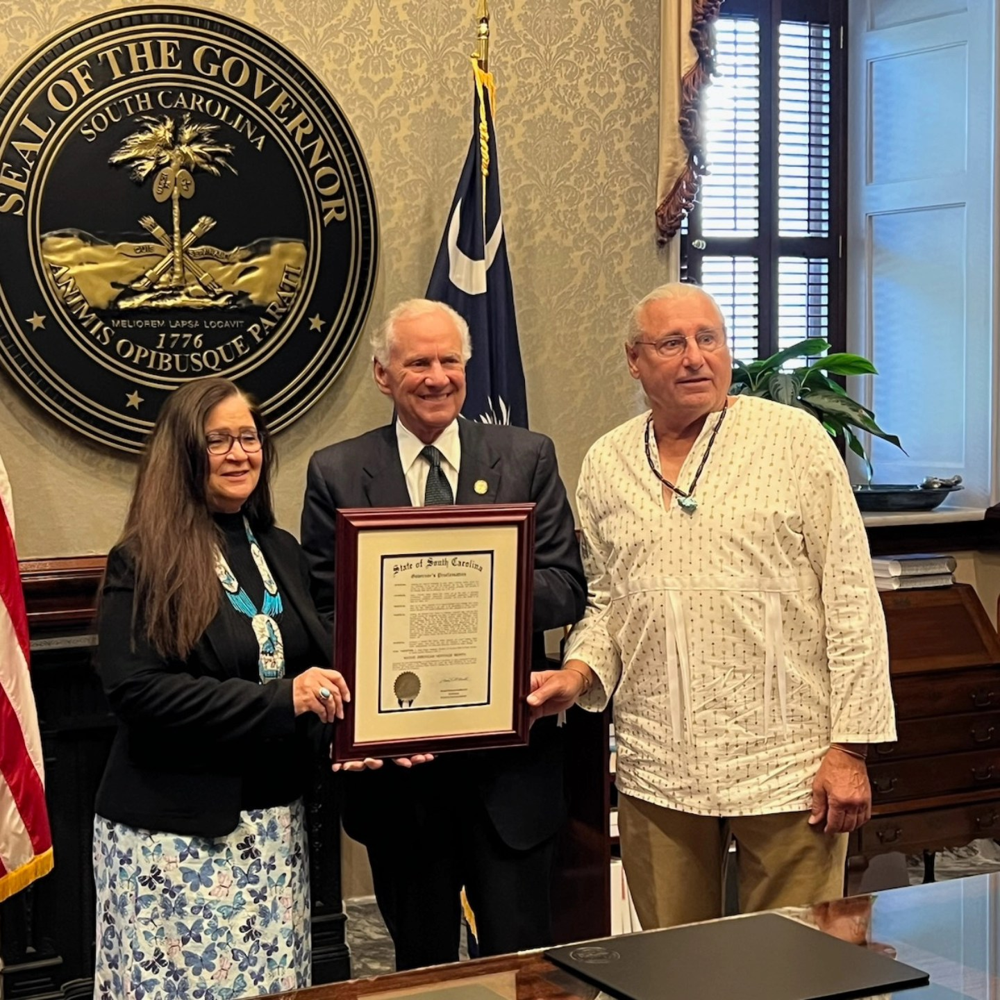
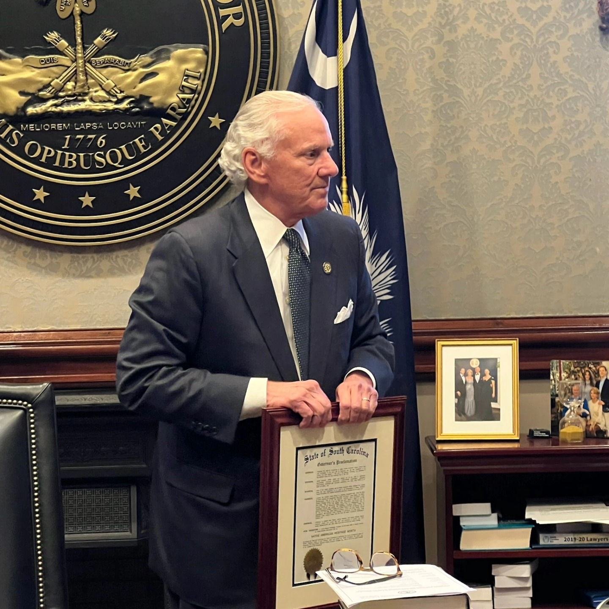
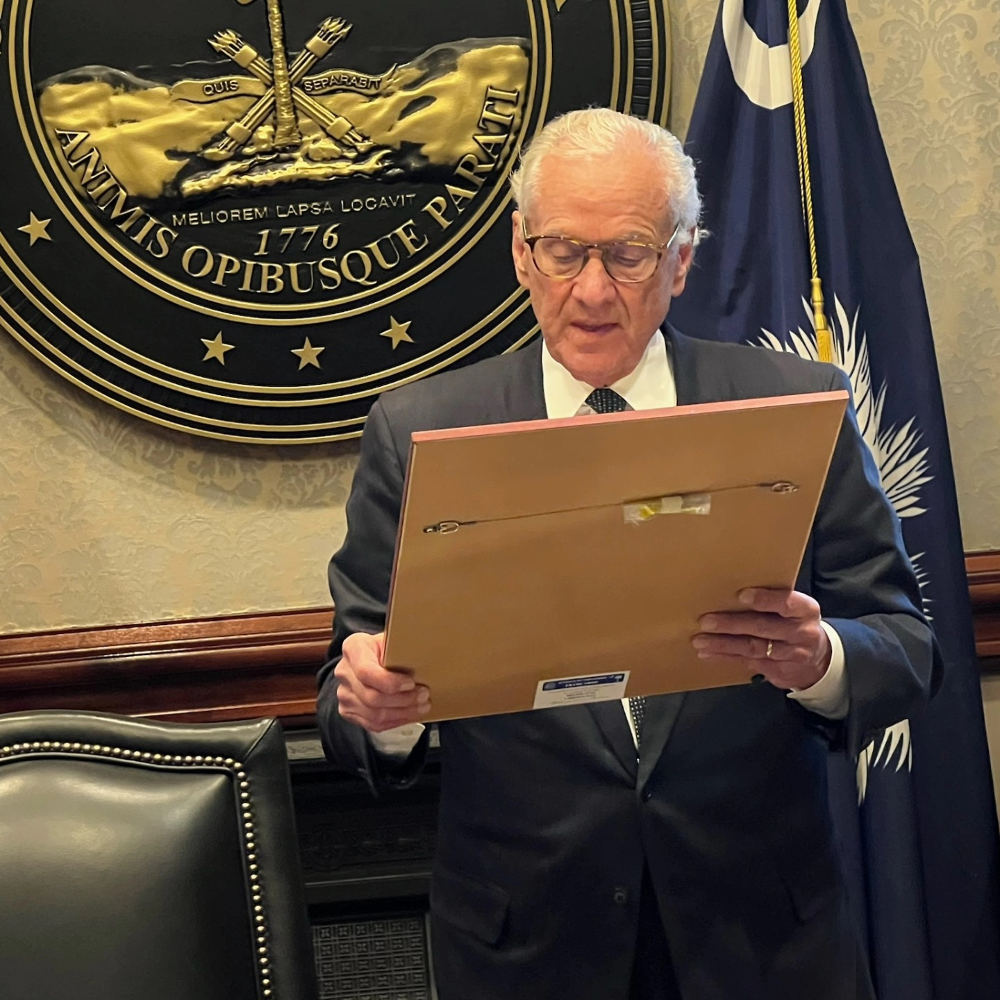
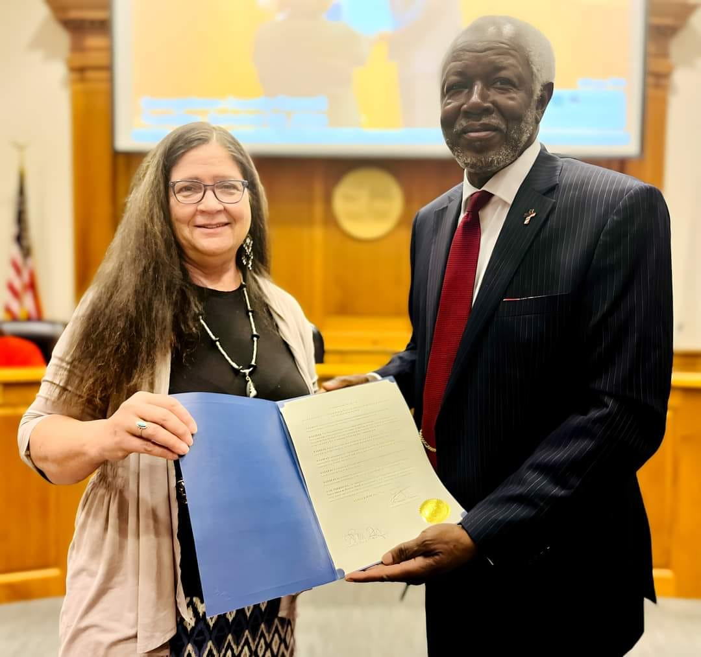
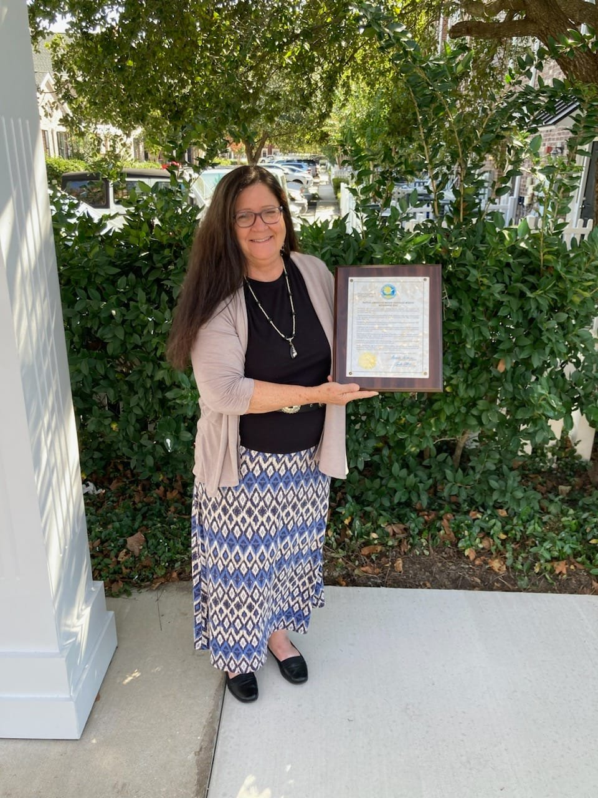
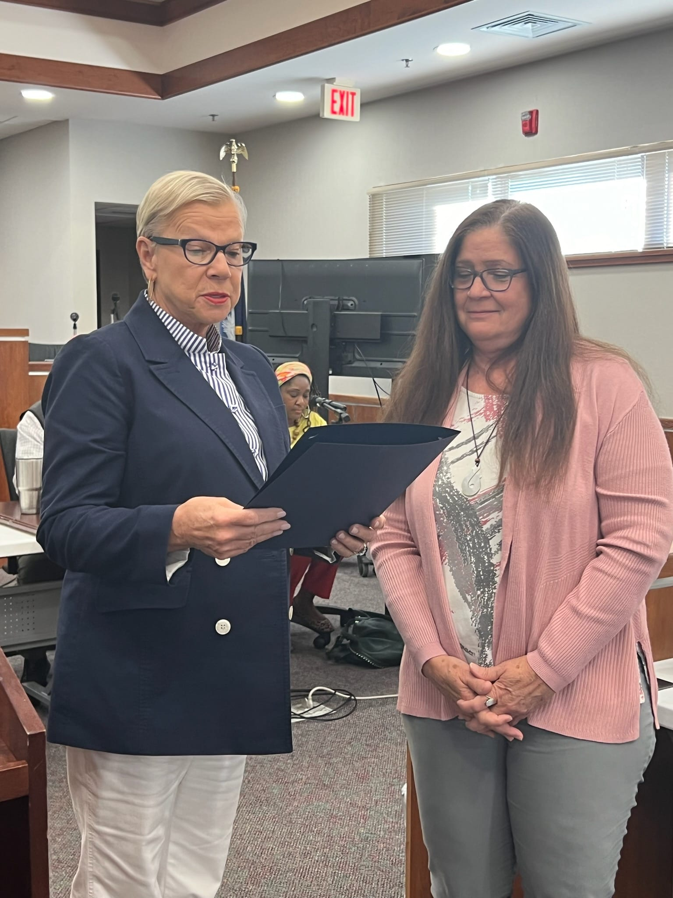
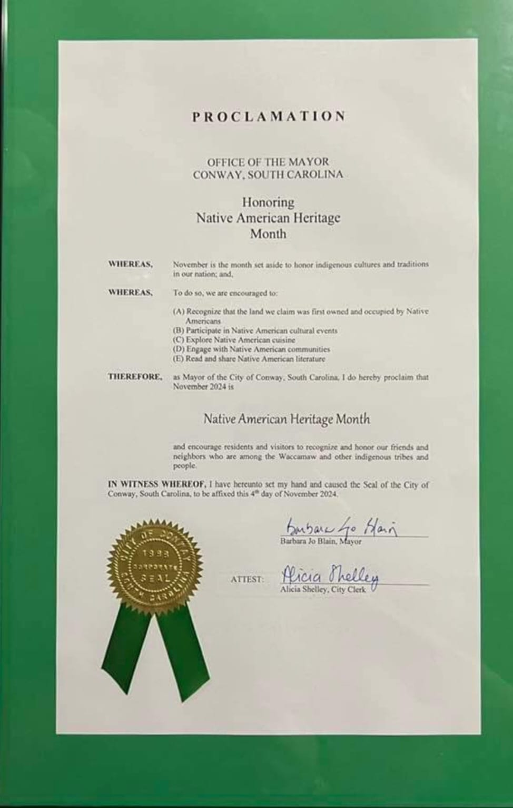

# Native American Heritage Month Proclamations

-

Michelle Hatcher
- Nov 13, 2024
- 1 min read

We thank the City of Conway and Mayor Barbara Blain, the City of Georgetown and Mayor Carol Jayroe, the City of Myrtle Beach and Mayor Brenda Bethune, the County of Georgetown and Councilman Louis Mourant, and SC Governor Henry McMaster for recognizing tribes in SC. We encourage the state legislature and SC residents to visit our tribal grounds.

Tags:

- [#Waccamaw](https://www.waccamaw.org/updates/tags/waccamaw-1)
- [#Native](https://www.waccamaw.org/updates/tags/native-2)
- [#NativeAmericanHeritageMonth](https://www.waccamaw.org/updates/tags/nativeamericanheritagemonth)

