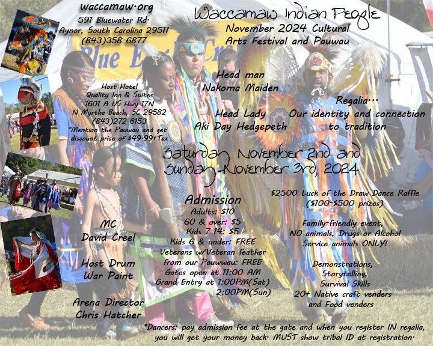
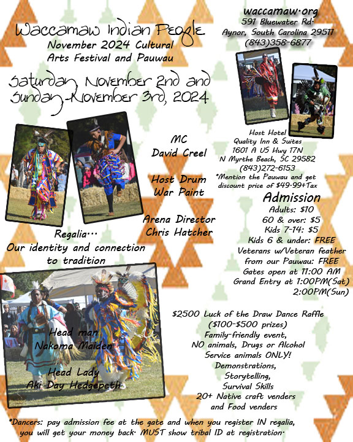

# Pauwau 2024 Fliers

-

Michelle Hatcher
- Sep 21, 2024
- 1 min read

Updated: Oct 1, 2024

Here are the fliers for our Pauwau for 2024. Update 10/1/2024: As of today, we will only have dancers list their tribal affiliation. Our pauwau is to showcase Indigenous art and the people who may win in the dance raffle will be Indigenous. Anyone may dance in the intertribal dances. Every dancer will be given a copy of the disclaimer and rules at the time of registration.

