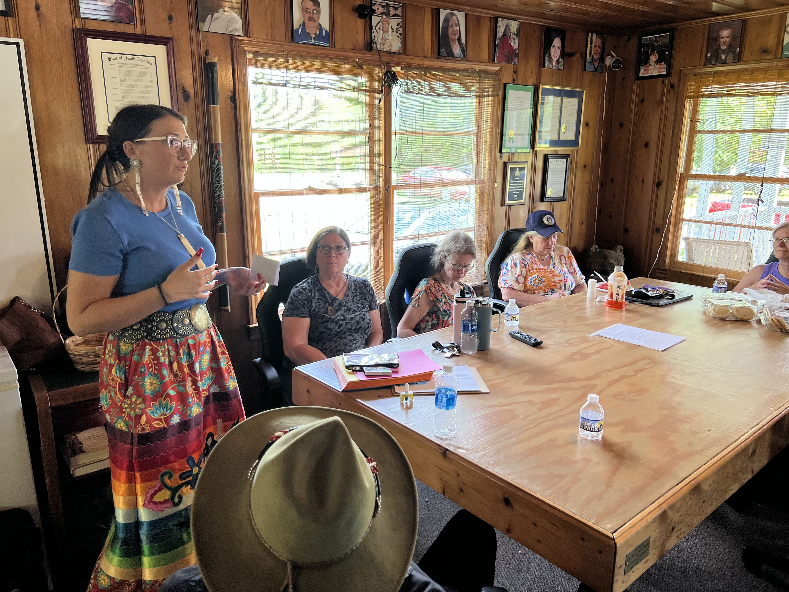
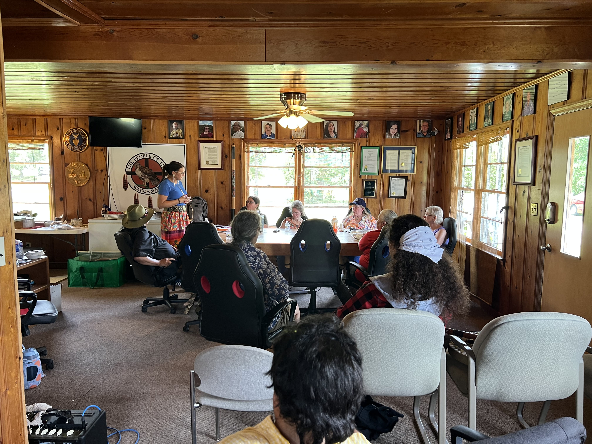
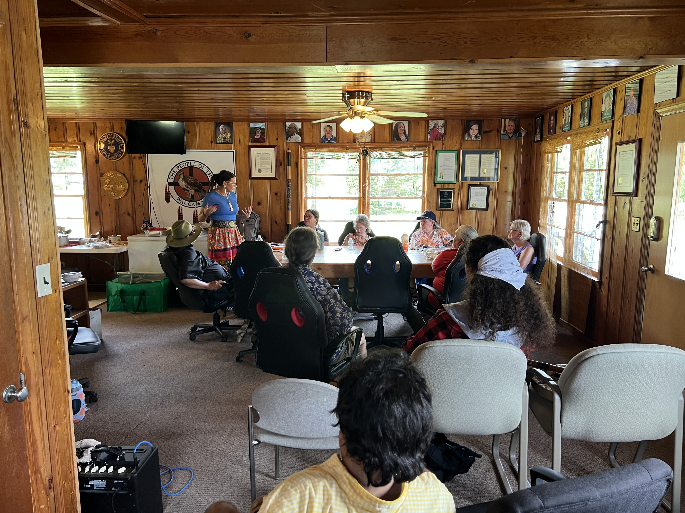
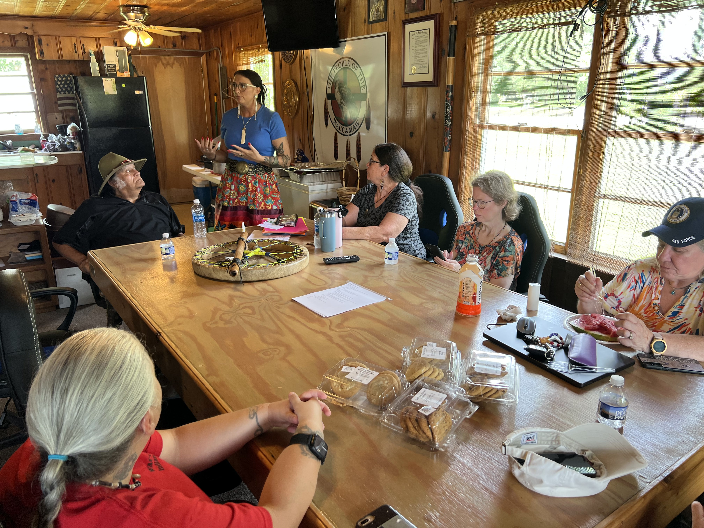
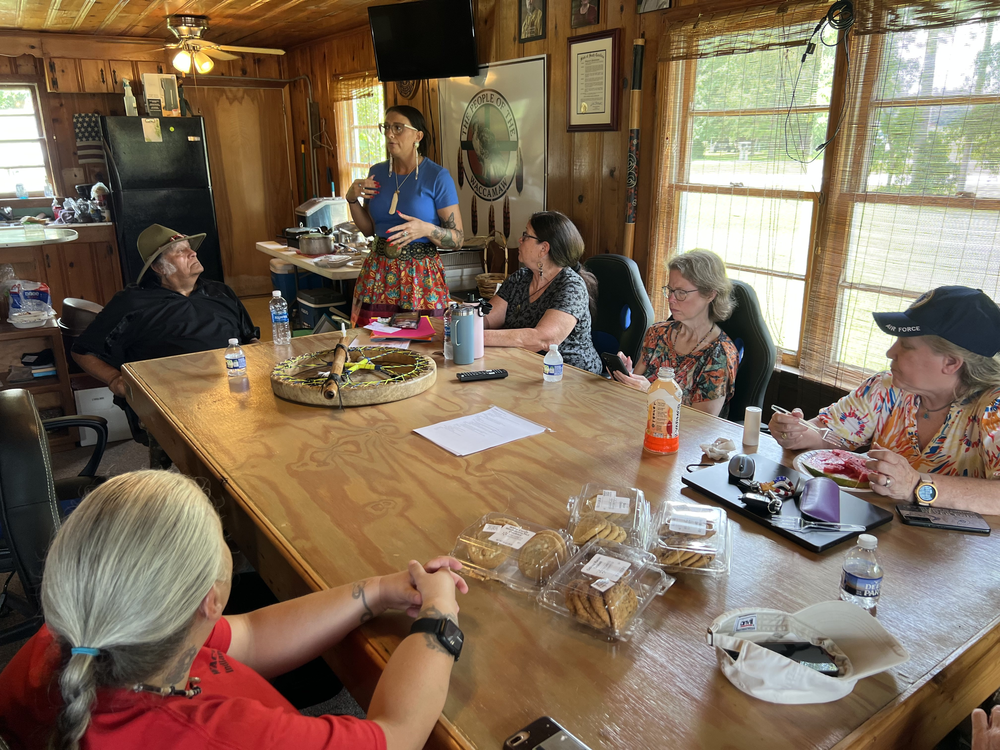
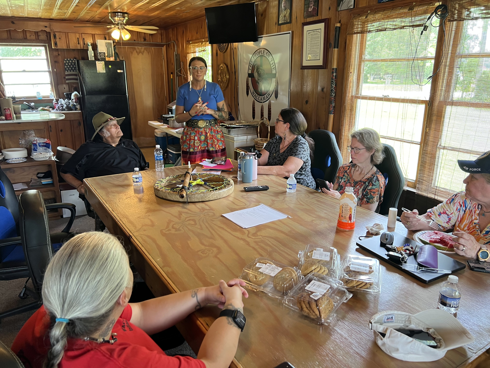
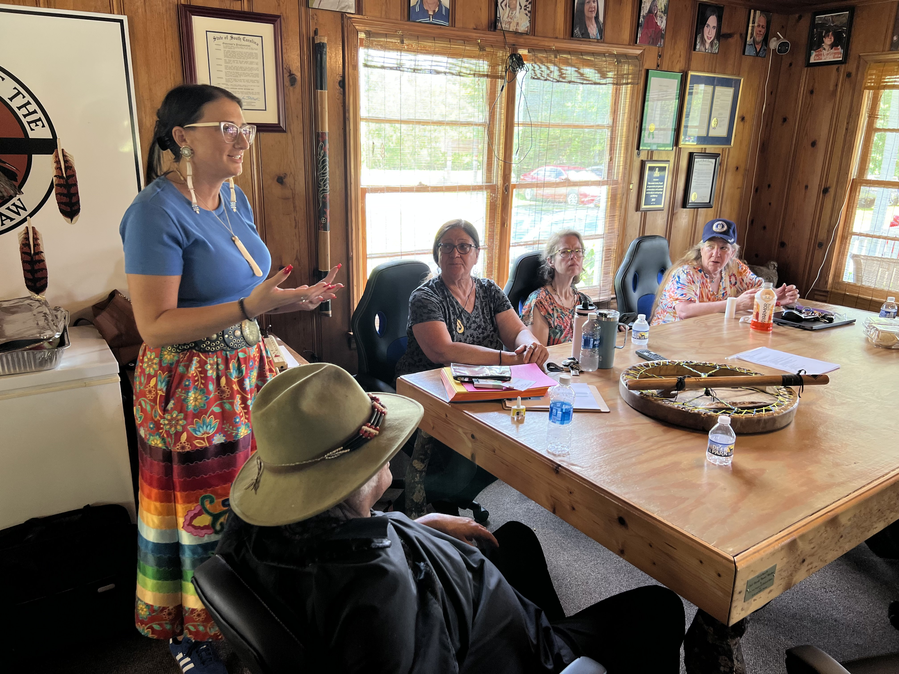
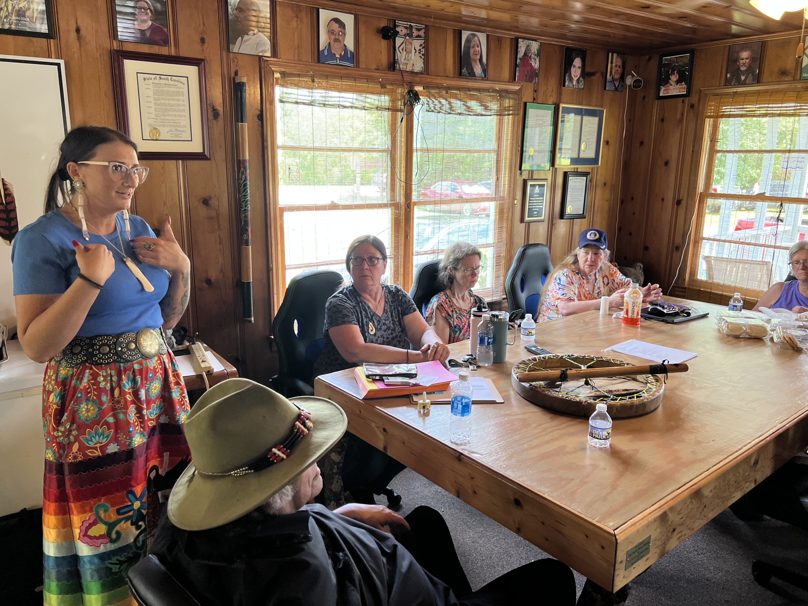
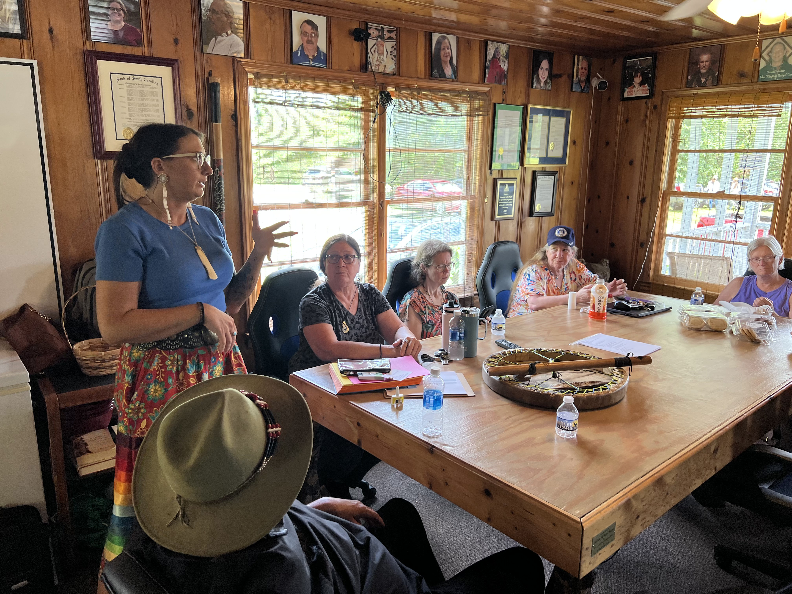
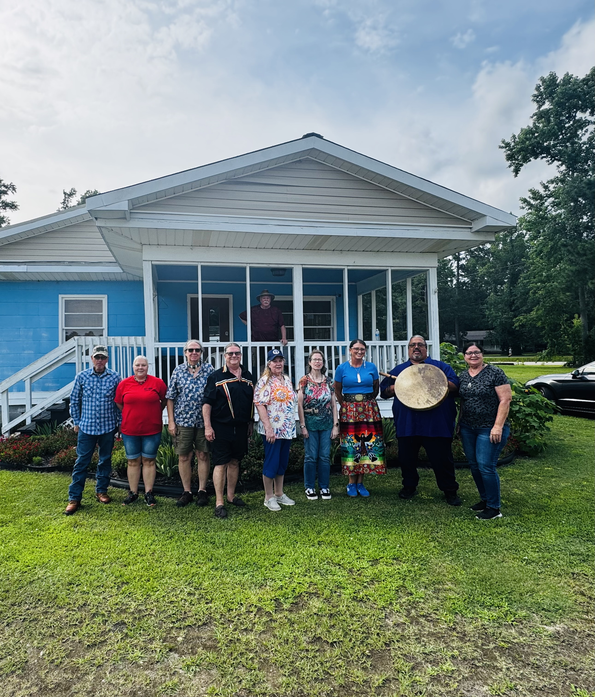

# SC Center of Excellence in Addiction: Narcan Training

-

Michelle Hatcher
- Jun 23
- 1 min read

Updated: Jul 10

We extend our heartfelt thanks to Amber Frazier of the Indigenous Women's Alliance of South Carolina, in collaboration with the SC Indian Affairs Commission and the SC Center of Excellence in Addiction. The Center provides expert consultation and technical assistance to help communities implement effective, evidence-based strategies for addiction treatment and prevention.

Amber also introduced us to her impactful work with The Courage Center, a Recovery Community Organization providing essential peer support and a safe, recovery-focused space for individuals and families affected by substance use.

She enlightened us about the journey of recovery, reminding us it’s non-linear and unique to each person. Amber educated us on the life-saving use of Narcan, the importance of respectful, person-first language (like “Substance Use Disorder” instead of “Substance Abuse”), and the life-saving impact of harm reduction.

In addition, she generously provided a wealth of resources related to behavioral health, housing, employment, and clothing, further supporting our communities on the path to healing and recovery.

Special thanks to the SC Indian Affairs Commission, now serving as Community Naloxone Distributors, for equipping each of the state’s tribes with Naloxone to help prevent overdoses and save lives. Community members can pick up Narcan at the Waccamaw Indian People tribal office located at 591 Bluewater Rd, Aynor, SC 29511. Please call ahead at  843-358-6877 to arrange for pickup.

**If you or someone you know needs Naloxone, please contact us—we’ll be glad to provide it.**

Tags:

- [#Waccamaw](https://www.waccamaw.org/updates/tags/waccamaw-1)
- [#CommunityOutreach](https://www.waccamaw.org/updates/tags/communityoutreach)
- [#SCCEA](https://www.waccamaw.org/updates/tags/sccea)

