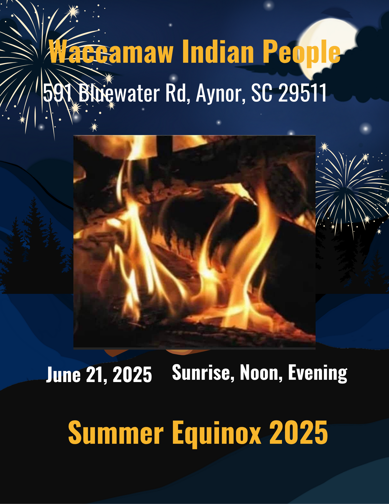

# Summer Solstice: June 21, 2025

-

Michelle Hatcher
- Jun 17
- 1 min read

Updated: Jun 20

Please join us on June 21, 2025, for the summer equinox on the tribal grounds at 591 Bluewater Rd, Aynor, SC 29511. This event is open to the public. Photographs of the sacred fire are not allowed. The ceremony will be held at 6:06 a.m., noon, and approximately 6:00 p.m. Lunch will be served after the noon ceremony. Reminder: The high temperature in the morning is expected to be around 75 degrees, with temperatures reaching 90 degrees in the afternoon. Please dress comfortably for the later forecast.

Tags:

- [#Waccamaw](https://www.waccamaw.org/updates/tags/waccamaw-1)
- [#Native](https://www.waccamaw.org/updates/tags/native-2)
- [community](https://www.waccamaw.org/updates/tags/community)
- [solstice](https://www.waccamaw.org/updates/tags/solstice)
- [#SaveTheDate](https://www.waccamaw.org/updates/tags/savethedate)

