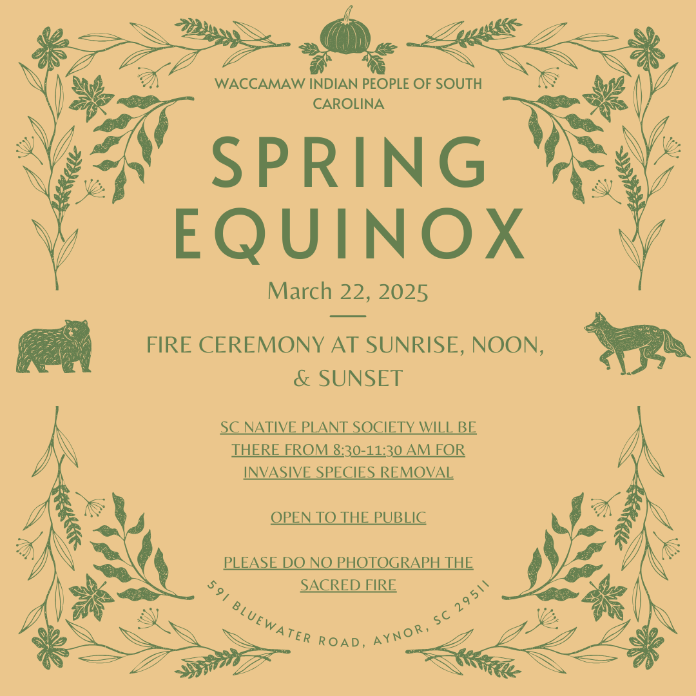

# Upcoming Events: March Edition

-

Michelle Hatcher
- Jan 29
- 1 min read

Don't forget to check out the Facebook page and Like the events:

[https://www.facebook.com/WaccamawIndianPeople](https://www.facebook.com/WaccamawIndianPeople)

3/1: Longhouse Project

3/8: Veterans Stand Down

3/22: Spring Equinox & Invasive Species Removal

Tags:

- [#Waccamaw](https://www.waccamaw.org/updates/tags/waccamaw-1)
- [#Native](https://www.waccamaw.org/updates/tags/native-2)
- [equinox](https://www.waccamaw.org/updates/tags/equinox)
- [B&G](https://www.waccamaw.org/updates/tags/b-g)
- [FamilyDay](https://www.waccamaw.org/updates/tags/familyday)

