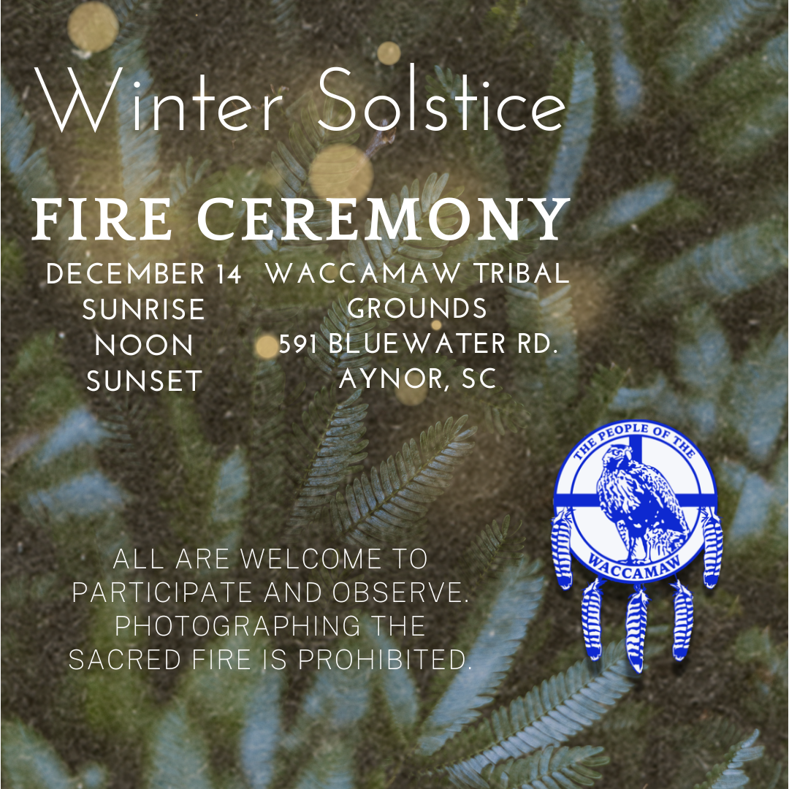

# Winter Solstice 2024

-

Michelle Hatcher
- Nov 13, 2024
- 1 min read

Updated: Dec 14, 2024

Please join us on December 14th for the winter solstice on the tribal grounds at 591 Bluewater Rd, Aynor, SC, 29511. This event is open to the public. Photographs of the sacred fire are not allowed. The ceremony will be held at 7:10 a.m., noon, and approximately 4:30 p.m. Lunch will be served after the noon ceremony. Reminder: The low temperature in the morning is expected to be around 50 to about 70 degrees later, so please dress comfortably.

Thank you to Jennifer Randall for creating the flyer.

Update: 12/14/2024:

We would like to thank everyone who attended the winter solstice today. We are grateful to the Creator for beautiful weather and seeing new faces.  We enjoyed great fellowship,  food, and a sense of community. We had our first talking circle with Kaya Littleturtle and his family. Led by Kaya, the experience brought our two tribes together and we learned more about the Good Mind Initiative. We hope to continue this by having another talking circle in January. The date is undetermined; however, we will keep you informed through our various social media posts and the tribal website calendar.

Tags:

- [#Waccamaw](https://www.waccamaw.org/updates/tags/waccamaw-1)
- [#Native](https://www.waccamaw.org/updates/tags/native-2)
- [Announcement](https://www.waccamaw.org/updates/tags/announcement)
- [event](https://www.waccamaw.org/updates/tags/event)
- [solstice](https://www.waccamaw.org/updates/tags/solstice)

