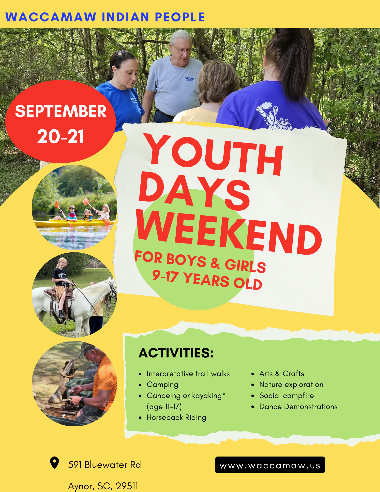

# Youth Weekend: September 2025

-

Michelle Hatcher
- Aug 17
- 1 min read

Updated: 2 hours ago

An educational and fun experience for youth ages 9-17 (roughly grades 6-11).

Day 1: At the Waccamaw Tribal grounds.

Participate in fishing with prizes given for the largest, smallest, and most fish caught. Ronnie Floyd's cultural presentation will explore how the Waccamaw utilize nature, showcasing traditional tools, plants, traps, and arts and crafts. Join Chief Cheryl Cail and Dr. Carolyn Dillian on a hike of the Waccamaw Indian People's Interpretive Trail. Learn about the different plant species during a walk of the tribal grounds with the Grand Strand Chapter of the SC Native Plant Society. Camp overnight using your tent and enjoy the campfire, storytelling, and social event. Lunch and dinner will be provided. Please bring your water bottle.

Day 2: NOTE: kayaking is age 11-17) From the Waccamaw Tribal grounds to Huggins Landing, Kayak or canoe on the Little Pee Dee with the Winyah Rivers Alliance and its Riverkeepers, who will outfit those needing lifejackets, while stories are shared of the river and Waccamaw Indians. Return to the Waccamaw Tribal grounds to join Tribal Elder Larry Jernigan and Nancy Jernigan for horseback rides. Breakfast will be provided. Please bring your water bottle.

Registration link: [https://www.zeffy.com/en-US/ticketing/youth-days-weekend-september--2025](https://www.zeffy.com/en-US/ticketing/youth-days-weekend-september--2025)

Tags:

- [#Waccamaw](https://www.waccamaw.org/updates/tags/waccamaw-1)
- [#Native](https://www.waccamaw.org/updates/tags/native-2)
- [#SaveTheDate](https://www.waccamaw.org/updates/tags/savethedate)
- [#YouthWeekend](https://www.waccamaw.org/updates/tags/youthweekend)

